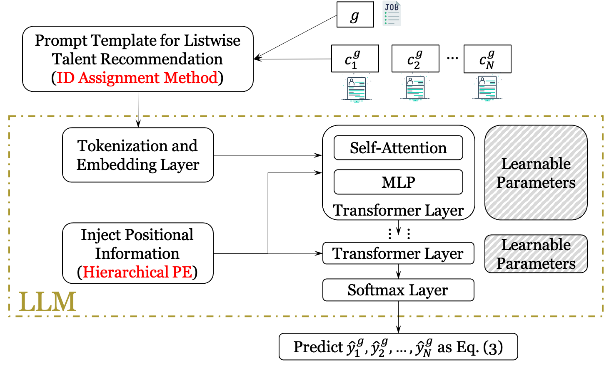
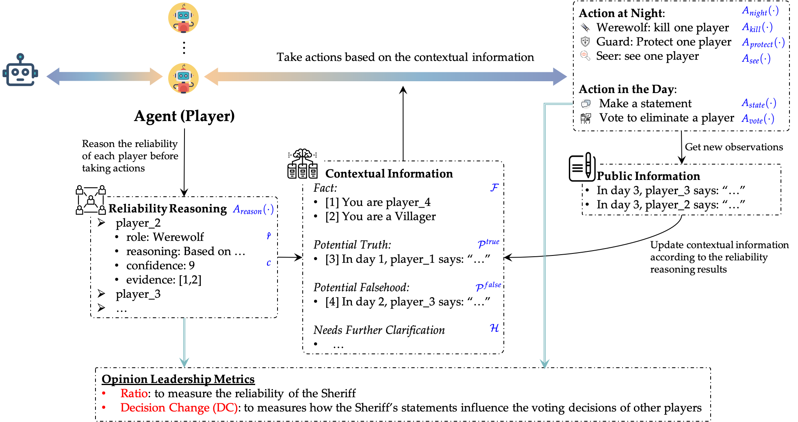


  You can also find my articles on <u><a href="{{author.googlescholar}}">my Google Scholar profile</a>.</u>





  


<!-- > ( $^{*}$ equal contribution, $^{\dagger}$ corresponding author) -->

> ( $^{*}$ equal contribution)

# 📝 Archived Publications

ICIS 2024

[C2] [L3TR: Large Language Models for Listwise Talent Recommendation.](https://www.mdpi.com/2072-4292/16/16/2899) **Silin Du**, Hongyan Liu. 

**International Conference on Information Systems (ICIS) 2024, Bangkok, Thailand.**

- **Keywords**:  Large language models, Talent recommendation, Listwise recommendation, Fine-tuning, Positional encoding, Position bias
- **Abstract:** Many companies encounter human resource challenges, with high recruitment costs and long hiring cycles being particularly prominent. Numerous studies propose models to expedite the matching of talent with jobs. The remarkable ability of large language models (LLMs) to understand texts provides unprecedented opportunities to build LLM-based talent recommendation models. However, previous attempts focus on the pointwise setting, requiring LLMs to repeatedly process some text and ignoring the relationship among talents in the candidate list, which is inefficient and inferior. Therefore, we propose a novel method to enhance LLMs with the listwise talent recommendation task, named L3TR. First, we propose two strategies to extract the recommendation results from LLMs. Then we design a hierarchical positional embedding to enhance the connection between the job postings and each resume in the candidate list. Experiments on a real-world dataset show the superiority of L3TR over classic methods and LLM-based methods in terms of accuracy.

COLM 2024

[C1] [Helmsman of the Masses? Evaluate the Opinion Leadership of Large Language Models in the Werewolf Game.](https://openreview.net/forum?id=xMt9kCv5YR#discussion) **Silin Du**, Xiaowei Zhang. 

**First Conference on Language Modeling (COLM) 2024, Philadelphia, United States.**

  

- **Keywords**: Opinion Leadership, Large Language Models, Werewolf Game, Simulation, Human-AI Interaction
- **Abstract:** Large language models (LLMs) have exhibited memorable strategic behaviors in social deductive games. However, the significance of opinion leadership exhibited by LLM-based agents has been overlooked, which is crucial for practical applications in multi-agent and human-AI interaction settings. Opinion leaders are individuals who have a noticeable impact on the beliefs and behaviors of others within a social group. In this work, we employ the Werewolf game as a simulation platform to assess the opinion leadership of LLMs. The game features the role of the Sheriff, tasked with summarizing arguments and recommending decision options, and therefore serves as a credible proxy for an opinion leader. We develop a framework integrating the Sheriff role and devise two novel metrics for evaluation based on the critical characteristics of opinion leaders. The first metric measures the reliability of the opinion leader, and the second assesses the influence of the opinion leader on other players' decisions. We conduct extensive experiments to evaluate LLMs of different scales. In addition, we collect a Werewolf question-answering dataset (WWQA) to assess and enhance LLM's grasp of the game rules, and we also incorporate human participants for further analysis. The results suggest that the Werewolf game is a suitable test bed to evaluate the opinion leadership of LLMs and few LLMs possess the capacity for opinion leadership.

# 📝 Working Paper
<!-- 

Arxiv 2024

 -->

[W3] A Disentangled Learning Framework for Bias-Controllable Large Language Model-based User Simulator. Shangkun Che *, **Silin Du** *, Hongyan Liu. 

[W2] Measuring Counterfactual Fairness of Large Language Model based Recommender Systems: An Identifiable Causal Model. Shangkun Che, **Silin Du**, Hongyan Liu, Xiaojie Mao. 

[W1] Exploring a New Competency Modeling Process via Large Language Models. **Silin Du**, Manqing Xin.

- **Keywords**: Large Language Models, Competency Modeling, Human Resources Management -->

<!-- 

 -->

